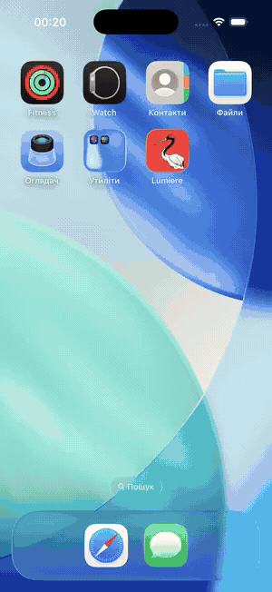
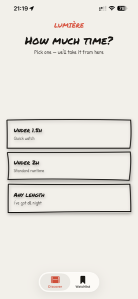
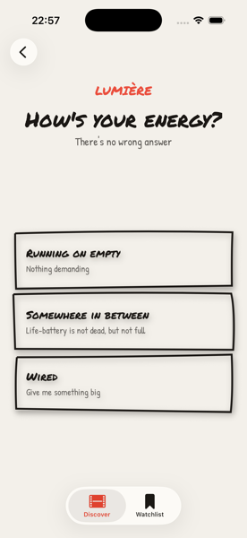
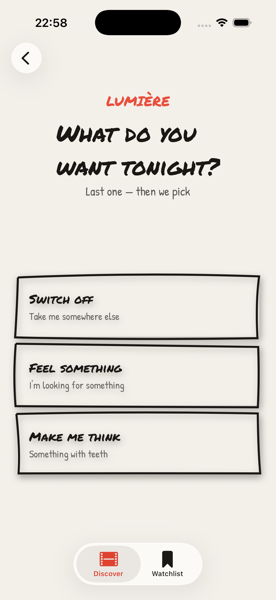
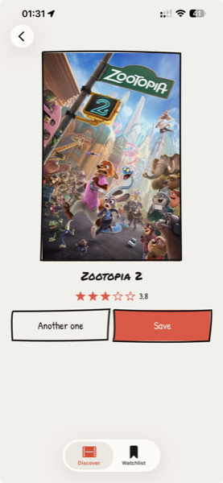
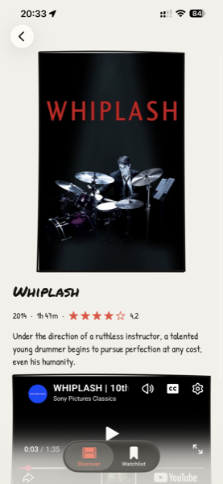
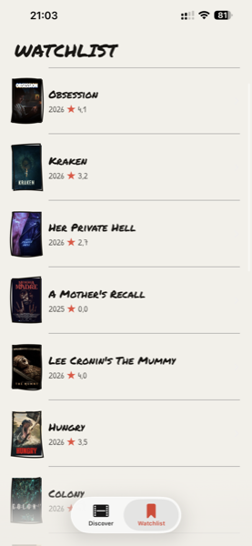

# Lumière

[](https://github.com/dmytriiyushchenko/lumiere/actions/workflows/ci.yml)

An iOS app built with SwiftUI, SwiftData and the TMDB API.

<p align="center">
  
</p>

I built this because of a habit I have. I open a streaming app around nine, scroll until eleven, and go to bed without watching anything. The problem was never that there's nothing on. It's that there's everything.

Lumière asks three questions and gives you one film. How much time you have, how your energy is, what you want tonight. Take it, save it, or ask for another one.

| Time | Energy | Intent |
|---|---|---|
|  |  |  |

| Result | Detail | Watchlist |
|---|---|---|
|  |  |  |

## Why three questions and not a search field

The first version asked for a genre. It had a nice screen and it was useless, and it took me a while to work out why: at nine in the evening I don't know my genre. I know I'm tired and I don't want to think. Genre is something you know afterwards, when you tell someone what you watched.

So the app asks about your state instead. Three energy levels, three intents, nine combinations, and each one has its own list of genres to look for and genres to stay away from.

One rule I had to add later, after testing it on myself: within the same energy level, the three intents are not allowed to share a single genre. Big films are tagged with four or five genres each, so the moment there's any overlap, "switch off" and "make me think" hand you the same blockbuster and the whole thing stops feeling like it listened to you.

## How it looks

Rough marker borders, Permanent Marker and Patrick Hand, a warm paper background, and a red-crowned crane that shows up on the splash screen. Most film apps are a dark grid of posters. I wanted something that looks drawn by hand rather than generated.

The borders aren't images. They're a small `Shape` that draws a slightly crooked rectangle from a seeded random generator, so every button gets its own imperfection and keeps the same one every time you open the app.

## How it's built

MVVM with `@Observable` view models. Views don't know the network exists. View models hold the state and talk to an injected client. Anything that has to survive a restart lives in SwiftData.

```
App            LumiereApp → RootView (splash, then a two-tab shell)

Networking     APIClient (protocol) → TMDBClient
               Endpoint + static factories: discover, movie, videos
               NetworkError (LocalizedError), Secrets

Models         Movie, MovieResponse, Video, VideoResponse
               Runtime, Energy, Intent, MoodProfile, TMDBGenre, LoadingState
Persistence    SavedMovie, SeenMovie  (SwiftData @Model)

View models    SuggestionViewModel, DetailViewModel  (@MainActor @Observable)

Features       Picker      TimeStepView → EnergyStepView → IntentStepView
               Result      ResultView
               Detail      DetailView
               Watchlist   WatchlistView

Design system  Theme (palette and spacing), OptionButton, StarRating,
               WizardHeader, RoughRectangle
```

`PickerView` drives the three steps through a `NavigationPath`. Each step is a dumb screen: it reports what you tapped and has no idea what comes next.

If you only want to look at a couple of files: [`MoodProfile`](Lumiere/Models/MoodProfile.swift) is the nine-way mood matrix, [`Endpoint`](Lumiere/Networking/Endpoint.swift) builds every TMDB URL, [`RoughRectangle`](Lumiere/DesignSystem/RoughRectangle.swift) draws the crooked borders, and [`LumiereApp`](Lumiere/App/LumiereApp.swift) is where the database is opened, or rebuilt when it cannot be.

Six tests cover decoding and the mood rules. GitHub Actions builds the app and runs them on every push and every pull request, on a clean machine and without an API token.

Built with Swift 6, SwiftUI and SwiftData, `async`/`await` over `URLSession`, the TMDB API, [Kingfisher](https://github.com/onevcat/Kingfisher) for posters, [YouTubePlayerKit](https://github.com/SvenTiigi/YouTubePlayerKit) for trailers, and Swift Testing for the tests.

## Things that went wrong first

**Trailers.** A plain `WKWebView` embed fails on YouTube with errors 152 and 153, because the web view drops the referer and the third-party cookies the player wants. I tried to make it work, then gave up and took a maintained library, keeping a plain link to YouTube as a fallback for videos whose owners disable embedding.

**Runtime.** `/discover` doesn't return a runtime, `/movie/{id}` does. Same `Movie` type for both, so `runtime` is optional. Making it non-optional would have broken decoding of every single discover response, which is exactly what happened before I understood why.

**Empty strings.** TMDB will happily send `"release_date": ""`. An empty string decodes perfectly, and then draws nothing under the title. Now the model treats a missing key and an empty value as the same thing, and there's a test with three films that says so.

**A film saved twice.** Saving a film checked a list on screen first, which felt like enough until an old database turned up with the same film in it twice. The check now lives on the model as a unique id, where the database enforces it instead of the button. Old stores that already broke the rule cannot be migrated, so the app rebuilds them rather than refusing to start.

**URLs.** Query strings used to be glued together by hand in three different files, each ending in a force-unwrapped `URL(string:)`. They all live in `Endpoint` now. `TMDBClient` unwraps the optional once and throws instead of crashing, and everything I know about someone else's API sits in one file.

## Running it

You need a free TMDB read access token. It isn't in the repo.

1. Put it in `Secrets.xcconfig` in the project root:
   ```
   TMDB_TOKEN = your_tmdb_read_access_token
   ```
2. Open `Lumiere.xcodeproj` and build. It's read from `Info.plist` at runtime.

iOS 18.6 and Xcode 26. The tests decode bundled fixtures and never touch the network, so they run without a token:

```bash
xcodebuild test -scheme Lumiere \
  -destination 'platform=iOS Simulator,name=iPhone 17 Pro'
```

## Where it is now

All six screens work and the app runs on a real phone. It isn't on the App Store yet.

Still on the list: a dark theme, custom fonts that scale with Dynamic Type, some animation for the crane while it's loading, and a field where you type what you feel like watching in your own words and let a model turn that into a query.

## Who wrote this

Dmytrii Yushchenko, iOS developer in Paris. Seven apps on the App Store, and this one next. I'm looking for a junior iOS position — the fastest way to reach me is through [my GitHub profile](https://github.com/dmytriiyushchenko).

## License

MIT, see [LICENSE](LICENSE).
