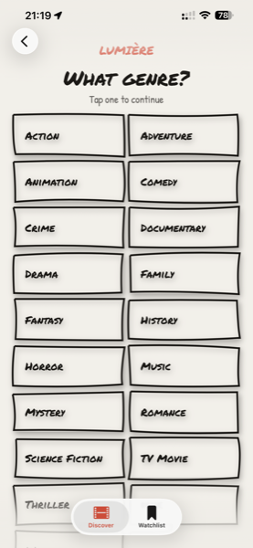

# Lumière

An iOS app for people who spend forty minutes choosing a film and then go to bed.

Two questions — how much time do you have, what are you in the mood for — and Lumière gives you one film. Not a grid, not a carousel, not a top-100 list. One. Take it or ask for another.

| Time | Genre | Result | Detail | Watchlist |
|---|---|---|---|---|
|  |  |  |  |  |

## The idea

Streaming catalogues are built for browsing. Browsing is pleasant and endless, which is exactly the problem — the more options you see, the harder the decision gets, and the evening is over before the film starts.

Lumière removes the catalogue. It asks two short questions, then commits to a single recommendation. Everything you save or skip is remembered, so the same blockbuster never comes back a second time.

## Design

Hand-drawn marker aesthetic instead of the dark glossy grid every film app uses: rough ink borders, Permanent Marker and Patrick Hand typefaces, a warm paper palette, and a red-crowned crane as the mascot.

The borders are not images. They are a custom `Shape` that draws slightly wobbly rectangles using a seeded random generator, so every element gets its own imperfection and keeps the same one between launches.

## Architecture

MVVM with `@Observable` view models. Views stay declarative and own no networking; view models own state and talk to an injected API client; SwiftData holds anything that has to survive a restart.

```
Networking     APIClient (protocol) → TMDBClient
               NetworkError, LoadingState

Models         Movie, MovieResponse, Genre, GenreResponse, Video
Persistence    SavedMovie, SeenMovie  (SwiftData @Model)

View models    GenreViewModel, SuggestionViewModel, DetailViewModel

Screens        TimeStepView → GenreStepView → ResultView → DetailView
               WatchlistView
Components     OptionButton, StarRating, WizardHeader, RoughRectangle
Design system  Theme (palette), Spacing
```

The wizard is coordinated by `PickerView` through a `NavigationPath`. Each step is a passive view: it reports the chosen value upwards through a callback and knows nothing about what comes next.

## Built with

- Swift, SwiftUI, SwiftData
- async/await with `URLSession`, `Codable`
- TMDB API — discover, genres, movie details, trailers
- [YouTubePlayerKit](https://github.com/SvenTiigi/YouTubePlayerKit) for in-app trailers
- Swift Testing for decoding tests

## Decisions worth explaining

**The API client is a protocol.** `TMDBClient` is one implementation; view models depend on `APIClient` and receive it through their initialiser. A mock plugs into the same socket, which is what makes the view models testable at all.

**Pagination loads early, not late.** The pool of films is fetched a page at a time, and the next page starts loading three cards before the end, so "another one" never waits on the network. A boolean guard stops a fast tapper from firing two identical requests while the first is still in flight.

**One model, two endpoints.** `/discover` returns films without a runtime; `/movie/{id}` includes it. `Movie.runtime` is therefore optional — making it non-optional would break decoding of every discover response, and the detail screen simply omits the runtime when it is missing.

**Trailers play inside the app.** A raw `WKWebView` embed fails on YouTube with errors 152 and 153, because the web view strips the referer and third-party cookies the player expects. Rather than fight that, the app uses a maintained library and keeps a plain link to YouTube as a fallback for videos whose owners disable embedding.

**The view model never touches the database.** Saving or skipping a film writes its id to a SwiftData store. The view reads that store and hands the list of ids to the view model, which filters every fetched page against it. The view model receives what it needs instead of reaching for it.

## Running it

The TMDB token is not in the repository. To build:

1. Create `Secrets.xcconfig` in the project root:
   ```
   TMDB_TOKEN = your_tmdb_read_access_token
   ```
2. Open `Lumiere.xcodeproj` and build. The token is read from the generated `Info.plist` at runtime.

## Status

v1.0 — the five screens above are complete and the app runs on device.

Next: dark theme, animated crane states for loading and empty lists, and a mood field where you describe what you feel like watching in plain language and an LLM turns it into a query.
